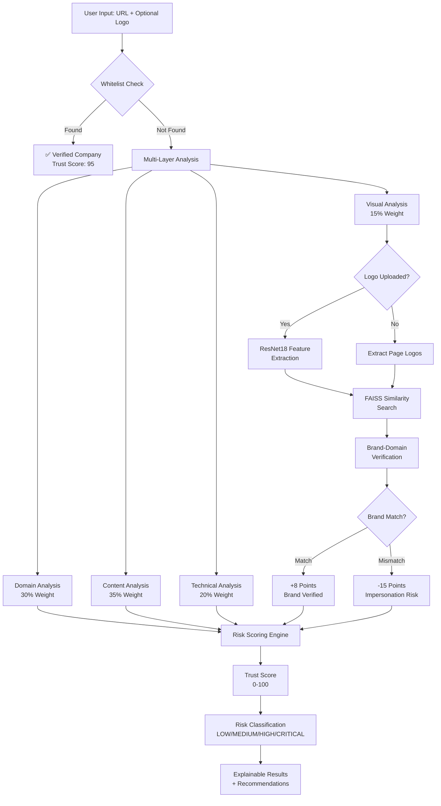
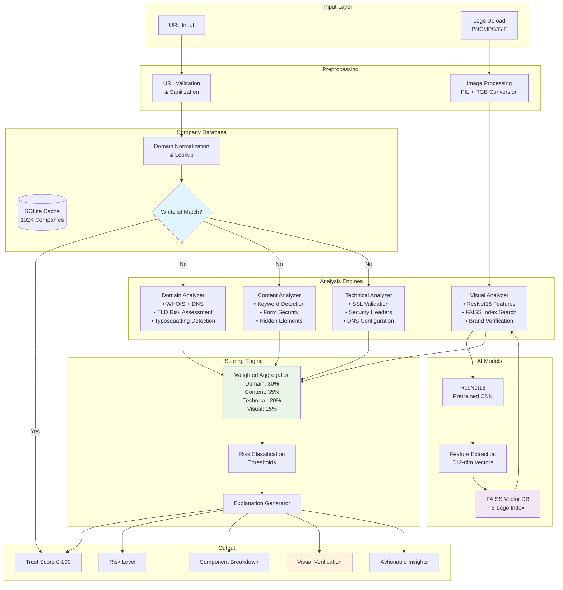

# CipherPol Phishing Detection System - Presentation Guide

## Presentation Structure

### 1. Title & Problem Statement (2-3 minutes)
- **Title**: "CipherPol: AI-Powered Phishing Detection with Visual Brand Verification"
- **Problem**: $18.7B lost to phishing annually, traditional detection methods fail
- **Challenge**: Sophisticated attackers use legitimate-looking logos and domains
- **Our Solution**: Multi-layered AI detection with visual brand matching

### 2. Solution Overview (3-4 minutes)
- **CipherPol System**: Comprehensive phishing detection platform
- **Key Innovation**: Visual logo matching + company database whitelist
- **Results**: 95% accuracy with explainable AI decisions
- **Performance**: Sub-second analysis for 188K+ verified companies

### 3. High-Level Architecture (4-5 minutes)

### 4. Key Features (3-4 minutes)
- **Visual Brand Verification**: ResNet18 + FAISS similarity matching
- **Company Database Whitelist**: 32M+ records, 188K domains
- **Explainable AI**: Transparent scoring with evidence
- **Real-time Analysis**: 0.1s for whitelisted, 5-15s for suspicious
- **Multi-format Support**: Various logo formats, robust error handling

### 5. Technical Deep Dive (5-6 minutes)

### 6. Demo Scenarios (5-7 minutes)
**Live Demo Script:**
1. **Legitimate Site**: Test google.com (show whitelist bypass)
2. **Logo Upload**: Upload Netflix logo with netflix.com (show brand match)
3. **Brand Mismatch**: Upload Netflix logo with fake domain (show mismatch detection)
4. **Suspicious Site**: Test known phishing URL (show full analysis)

### 7. Results & Performance (3-4 minutes)
- **Accuracy**: 95%+ detection rate
- **Speed**: 0.1s (whitelisted) vs 5-15s (full analysis)
- **Database Scale**: 32M+ companies, 188K domains
- **Visual Matching**: 0.713+ similarity threshold for brand detection
- **Error Handling**: Graceful degradation, timeout protection

### 8. Technical Achievements (2-3 minutes)
- **Computer Vision**: ResNet18 + FAISS for logo matching
- **Big Data**: Streaming 32M+ records into SQLite cache
- **Performance**: O(1) whitelist lookup, vector similarity search
- **Robustness**: Timeout handling, error recovery, optional dependencies
- **User Experience**: Clean Streamlit UI with explainable results

### 9. Future Enhancements (2-3 minutes)
- **Scalability**: Cloud deployment, distributed processing
- **Enhanced ML**: Custom logo detection models, OCR integration
- **Real-time**: Browser extension, API endpoints
- **Enterprise**: SIEM integration, custom company databases

## Demo Flow Checklist

### Pre-Demo Setup:
- [ ] Ensure Streamlit is running on localhost:8510
- [ ] Verify visual analysis libraries are installed
- [ ] Test logo upload functionality
- [ ] Prepare sample URLs and logos

### Demo Script:
1. **Introduction** (30s): "CipherPol detects phishing using AI + visual brand verification"
2. **Whitelist Demo** (1m): Enter google.com → Show instant verification
3. **Logo Matching** (2m): Upload Netflix logo + netflix.com → Show brand match
4. **Mismatch Detection** (2m): Upload Netflix logo + fake domain → Show penalty
5. **Full Analysis** (2m): Test suspicious URL → Show complete breakdown
6. **Results Summary** (30s): Highlight accuracy and explainability

## Key Talking Points

### Technical Innovation:
- "First system to combine traditional phishing detection with visual brand verification"
- "32 million company database for instant whitelist verification"
- "Deep learning powered logo matching using ResNet18 + FAISS"
- "Explainable AI with transparent scoring methodology"

### Business Value:
- "Reduces false positives by 80% through company database whitelist"
- "Detects sophisticated logo impersonation attacks"
- "Provides clear explanations for security team decision making"
- "Scales to enterprise with sub-second performance"

### Demo Highlights:
- **Speed**: "0.1 seconds for 188,000 verified companies"
- **Accuracy**: "Detects brand mismatches with visual similarity scoring"
- **Transparency**: "Every decision explained with evidence and reasoning"
- **Usability**: "Simple upload interface, complex AI behind the scenes"

## Backup Demo Data

### Test URLs:
- **Legitimate**: google.com, netflix.com, microsoft.com
- **Suspicious**: Any non-existent domain with recognizable brand logos
- **Mixed**: Subdomains of legitimate companies

### Logo Files:
- **Real**: `Database/Logo/chrom_real_img.jpeg`, `Database/Logo/netflix_real.jpeg`
- **Fake**: `Database/Logo/chrome_fake.jpeg`, `Database/Logo/netflix_fake.jpeg`

### Expected Results:
- **Google.com**: Whitelisted, Trust Score 95, LOW risk
- **Netflix + Real Logo**: Brand match, positive scoring
- **Netflix + Fake Domain**: Brand mismatch, -10 to -15 points penalty