# CipherPol Phishing Detection System - Presentation Guide

## Presentation Structure

### 1. Title & Problem Statement (2-3 minutes)
- **Title**: "CipherPol: AI-Powered Phishing Detection with Visual Brand Verification + LLM Validation"
- **Problem**: $18.7B lost to phishing annually, traditional detection methods fail
- **Challenge**: Sophisticated attackers use legitimate-looking logos and domains
- **Our Solution**: Multi-layered AI detection with visual brand matching + Gemini LLM expert validation

### 2. Solution Overview (3-4 minutes)
- **CipherPol System**: Comprehensive phishing detection platform
- **Key Innovation**: Visual logo matching + company database whitelist + Gemini LLM validation
- **Results**: 95% accuracy with explainable AI decisions + expert LLM assessment
- **Performance**: Sub-second analysis for 188K+ verified companies, ~15-30s with AI validation

### 3. High-Level Architecture (4-5 minutes)

```mermaid
graph TD
    A[User Input: URL + Optional Logo] --> B{Whitelist Check}
    B -->|Found| C[✅ Verified Company<br/>Trust Score: 95]
    B -->|Not Found| D[Multi-Layer Analysis]
    
    D --> E[Domain Analysis<br/>30% Weight]
    D --> F[Content Analysis<br/>35% Weight]
    D --> G[Technical Analysis<br/>20% Weight]
    D --> H[Visual Analysis<br/>15% Weight]
    
    H --> I{Logo Uploaded?}
    I -->|Yes| J[ResNet18 Feature<br/>Extraction]
    I -->|No| K[Extract Page Logos]
    
    J --> L[FAISS Similarity<br/>Search]
    K --> L
    
    L --> M[Brand-Domain<br/>Verification]
    M --> N{Brand Match?}
    N -->|Match| O[+8 Points<br/>Brand Verified]
    N -->|Mismatch| P[-15 Points<br/>Impersonation Risk]
    
    E --> Q[Risk Scoring Engine]
    F --> Q
    G --> Q
    O --> Q
    P --> Q
    
    Q --> R[Traditional Results<br/>Trust Score 0-100]
    R --> S[🧠 Gemini LLM Analysis]
    
    S --> T{AI Available?}
    T -->|Yes| U[AI Expert Assessment<br/>Verdict + Confidence + Reasoning]
    T -->|No| V[Traditional Recommendation]
    
    U --> W[Final Results<br/>Traditional + AI Validation]
    V --> X[Traditional Results Only]
```

### 4. Key Features (3-4 minutes)
- **Visual Brand Verification**: ResNet18 + FAISS similarity matching
- **Company Database Whitelist**: 32M+ records, 188K domains
- **Gemini LLM Validation**: Expert AI assessment with reasoning
- **Progressive UI**: Traditional results immediate, AI validation progressive
- **Explainable AI**: Transparent scoring with evidence + AI reasoning
- **Real-time Analysis**: 0.1s for whitelisted, 5-15s traditional, +10-20s AI validation
- **Multi-format Support**: Various logo formats, robust error handling

### 5. Technical Deep Dive (5-6 minutes)

```mermaid
graph TB
    subgraph "Input Layer"
        A1[URL Input]
        A2[Logo Upload<br/>PNG/JPG/GIF]
    end
    
    subgraph "Preprocessing"
        B1[URL Validation<br/>& Sanitization]
        B2[Image Processing<br/>PIL + RGB Conversion]
    end
    
    subgraph "Company Database"
        C1[(SQLite Cache<br/>192K Companies)]
        C2[Domain Normalization<br/>& Lookup]
        C3{Whitelist Match?}
    end
    
    subgraph "Analysis Engines"
        D1[Domain Analyzer<br/>• WHOIS + DNS<br/>• TLD Risk Assessment<br/>• Typosquatting Detection]
        
        D2[Content Analyzer<br/>• Keyword Detection<br/>• Form Security<br/>• Hidden Elements]
        
        D3[Technical Analyzer<br/>• SSL Validation<br/>• Security Headers<br/>• DNS Configuration]
        
        D4[Visual Analyzer<br/>• ResNet18 Features<br/>• FAISS Index Search<br/>• Brand Verification]
        
        D5[Gemini LLM Analyzer<br/>• Expert Assessment<br/>• Structured Reasoning<br/>• Final Validation]
    end
    
    subgraph "AI Models"
        E1[ResNet18<br/>Pretrained CNN]
        E2[FAISS Vector DB<br/>5-Logo Index]
        E3[Feature Extraction<br/>512-dim Vectors]
        E4[Gemini 2.5 Flash<br/>Expert LLM Model]
    end
    
    subgraph "Scoring Engine"
        F1[Weighted Aggregation<br/>Domain: 30%<br/>Content: 35%<br/>Technical: 20%<br/>Visual: 15%]
        F2[Risk Classification<br/>Thresholds]
        F3[Explanation Generator]
        F4[Gemini Integration<br/>Traditional → AI Validation]
    end
    
    subgraph "Output"
        G1[Traditional Analysis<br/>Trust Score 0-100]
        G2[AI Expert Assessment<br/>Verdict + Confidence]
        G3[Component Breakdown]
        G4[Visual Verification]
        G5[AI Reasoning & Recommendations]
    end
    
    A1 --> B1
    A2 --> B2
    B1 --> C2
    C2 --> C3
    
    C3 -->|Yes| G1
    C3 -->|No| D1
    C3 -->|No| D2
    C3 -->|No| D3
    
    B2 --> D4
    D4 --> E1
    E1 --> E3
    E3 --> E2
    E2 --> D4
    
    D1 --> F1
    D2 --> F1
    D3 --> F1
    D4 --> F1
    
    F1 --> F2
    F2 --> F3
    F3 --> G1
    F3 --> F4
    
    F4 --> E4
    E4 --> G2
    F3 --> G3
    F3 --> G4
    G2 --> G5
    
    style C3 fill:#e1f5fe
    style E2 fill:#f3e5f5
    style E4 fill:#ffe0e0
    style F1 fill:#e8f5e8
    style G2 fill:#fff3e0
```

### 6. Demo Scenarios (5-7 minutes)
**Live Demo Script:**
1. **Legitimate Site**: Test google.com (show whitelist bypass + AI confirms safe)
2. **Logo Upload**: Upload Netflix logo with netflix.com (show brand match + AI validation)
3. **Brand Mismatch**: Upload Netflix logo with fake domain (show mismatch + AI detects impersonation)
4. **Phishing Site**: Test paypal-carregamento.pt (show AI detects "malicious" with 95% confidence)
5. **Progressive UI**: Demonstrate traditional results appearing first, then AI assessment

### 7. Results & Performance (3-4 minutes)
- **Accuracy**: 95%+ detection rate + AI expert validation
- **Speed**: 0.1s (whitelisted), 5-15s (traditional), +10-20s (AI validation)
- **Database Scale**: 32M+ companies, 188K domains
- **Visual Matching**: 0.713+ similarity threshold for brand detection
- **AI Model**: Gemini 2.5 Flash with 2-minute timeout
- **Error Handling**: Graceful degradation, fallback to traditional if AI fails

### 8. Technical Achievements (2-3 minutes)
- **Computer Vision**: ResNet18 + FAISS for logo matching
- **Large Language Model**: Gemini 2.5 Flash integration with structured prompts
- **Big Data**: Streaming 32M+ records into SQLite cache
- **Performance**: O(1) whitelist lookup, vector similarity search
- **Progressive UX**: Non-blocking UI with immediate traditional results + AI enhancement
- **Robustness**: Timeout handling, error recovery, graceful AI fallback

### 9. Future Enhancements (2-3 minutes)
- **Advanced AI**: Multi-modal LLM analysis, custom fine-tuned models
- **Scalability**: Cloud deployment, distributed processing
- **Enhanced ML**: Custom logo detection models, OCR integration
- **Real-time**: Browser extension, API endpoints
- **Enterprise**: SIEM integration, custom company databases, AI model selection

## Demo Flow Checklist

### Pre-Demo Setup:
- [ ] Ensure Streamlit is running on localhost:8510
- [ ] Verify visual analysis libraries are installed
- [ ] Test logo upload functionality
- [ ] Prepare sample URLs and logos

### Demo Script:
1. **Introduction** (30s): "CipherPol detects phishing using AI + visual brand verification + LLM validation"
2. **Whitelist Demo** (1m): Enter google.com → Show instant verification + AI confirmation
3. **Logo Matching** (2m): Upload Netflix logo + netflix.com → Show brand match + AI assessment
4. **Mismatch Detection** (2m): Upload Netflix logo + fake domain → Show penalty + AI detects impersonation
5. **Phishing Detection** (3m): Test paypal-carregamento.pt → Show AI detects "malicious" with 95% confidence
6. **Progressive UI** (1m): Demonstrate traditional results first, then AI validation appears
7. **Results Summary** (30s): Highlight traditional + AI accuracy and explainability

## Key Talking Points

### Technical Innovation:
- "First system to combine traditional phishing detection with visual brand verification + LLM expert validation"
- "32 million company database for instant whitelist verification"
- "Deep learning powered logo matching using ResNet18 + FAISS"
- "Gemini 2.5 Flash integration with structured prompts and reasoning"
- "Progressive UI architecture: immediate traditional results + enhanced AI validation"

### Business Value:
- "Reduces false positives by 80% through company database whitelist + AI validation"
- "Detects sophisticated logo impersonation attacks with expert AI assessment"
- "Provides clear explanations for security team decision making with AI reasoning"
- "Scales to enterprise with sub-second performance + optional AI enhancement"

### Demo Highlights:
- **Speed**: "0.1 seconds for 188,000 verified companies + 10-20s AI validation"
- **Accuracy**: "Detects brand mismatches with visual similarity + AI expert assessment"
- **Transparency**: "Every decision explained with evidence, reasoning, and AI analysis"
- **Progressive UX**: "Immediate traditional results, enhanced with AI validation"
- **AI Integration**: "Gemini 2.5 Flash provides expert cybersecurity assessment"

## Backup Demo Data

### Test URLs:
- **Legitimate**: google.com, netflix.com, microsoft.com, ft.com
- **Phishing**: paypal-carregamento.pt (AI detects "malicious" 95% confidence)
- **Netflix Clone**: seunelvis1.github.io/NetflixClone1.github.io (AI assessment available)
- **Mixed**: Subdomains of legitimate companies

### Logo Files:
- **Real**: `Database/Logo/chrom_real_img.jpeg`, `Database/Logo/netflix_real.jpeg`
- **Fake**: `Database/Logo/chrome_fake.jpeg`, `Database/Logo/netflix_fake.jpeg`

### Expected Results:
- **Google.com**: Whitelisted, Trust Score 95, LOW risk + AI confirms "safe"
- **Netflix + Real Logo**: Brand match, positive scoring + AI validation
- **Netflix + Fake Domain**: Brand mismatch, -10 to -15 points penalty + AI detects impersonation
- **PayPal Phishing**: AI detects "malicious" with 95% confidence and detailed reasoning